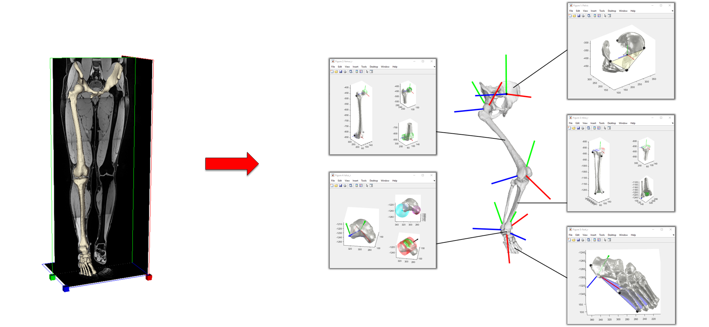
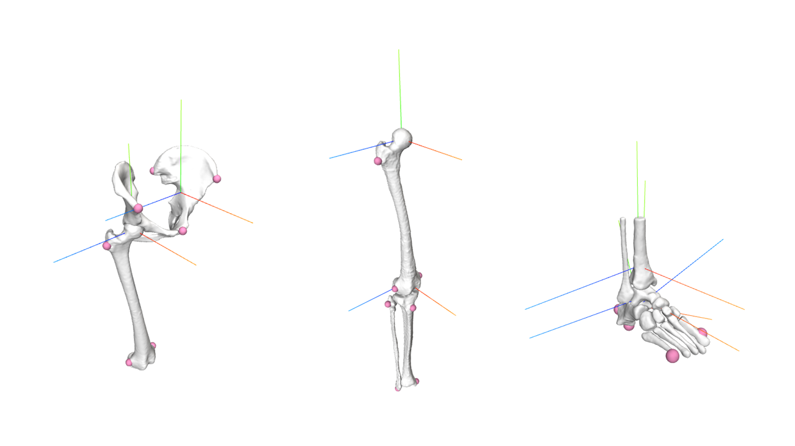
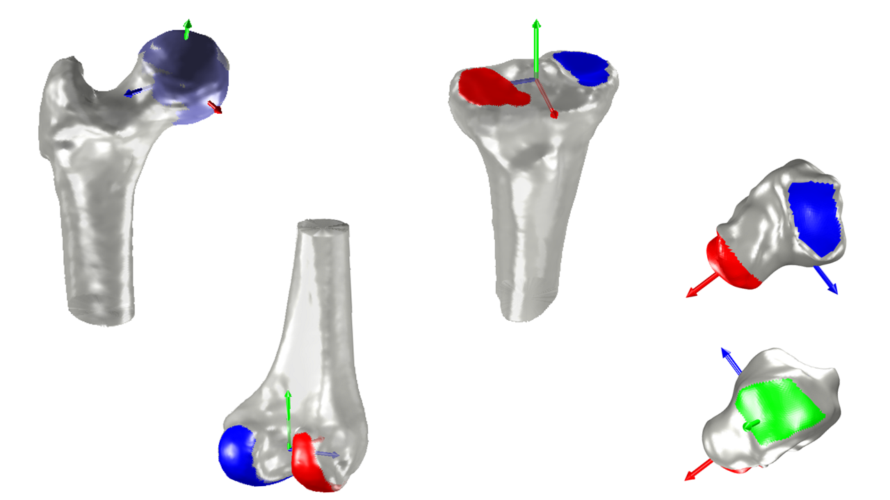
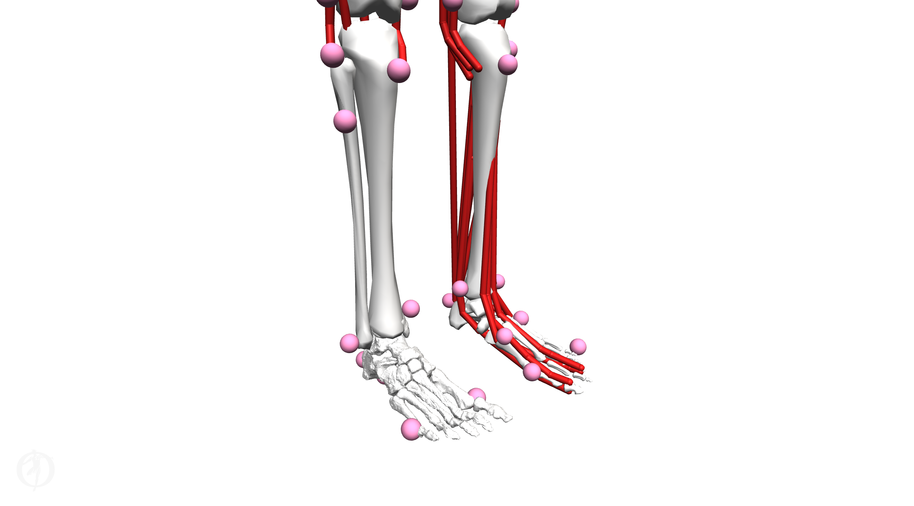
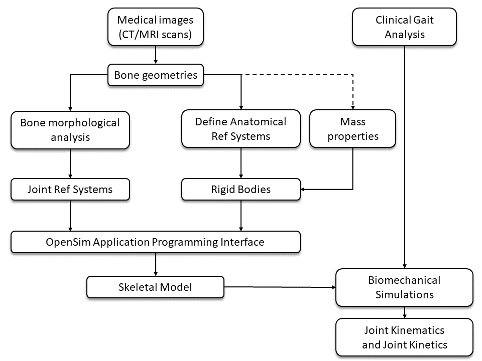

# STAPLE: Shared Tools for Automatic Personalised Lower Extremity modelling <!-- omit in toc -->

[](https://creativecommons.org/licenses/by-nc/4.0/)  [](https://doi.org/10.5281/zenodo.4428103)   <!-- omit in toc -->

### ⚠️ STAPLE is released under a [non-commercial license](#license) and it is free to use for academic purposes only. For any other use please contact the authors. 

# Table of contents <!-- omit in toc -->
- [What is STAPLE?](#what-is-staple)
- [What can I do with STAPLE?](#what-can-i-do-with-staple)
- [Requirements](#requirements)
- [Installation](#installation)
- [How to use the STAPLE toolbox](#how-to-use-the-staple-toolbox)
  - [Workflow to generate subject-specific lower limb models](#workflow-to-generate-subject-specific-lower-limb-models)
  - [Before using STAPLE: data preparation](#before-using-staple-data-preparation)
  - [Quick start guide: provided workflows](#quick-start-guide-provided-workflows)
  - [Detailed steps to setup a STAPLE workflow](#detailed-steps-to-setup-a-staple-workflow)
  - [Algorithms for bone morphological analysis](#algorithms-for-bone-morphological-analysis)
  - [Datasets available for testing](#datasets-available-for-testing)
  - [STAPLE variables and conventions](#STAPLE-variables-and-conventions)
- [Troubleshooting your workflow](#troubleshooting-your-workflow)
- [Does STAPLE work only with OpenSim?](#does-staple-work-only-with-opensim)
- [What are the differences between the STAPLE toolbox, NMSBuilder and the MAP Client for generating OpenSim models?](#what-are-the-differences-between-the-staple-toolbox-nmsbuilder-and-the-map-client-for-generating-opensim-models)
- [Current limitations](#current-limitations)
- [How to contribute](#how-to-contribute)
- [Code of conduct](#code-of-conduct)
- [License](#license)
- [Acknowledgements](#acknowledgements)

## What is STAPLE?
**STAPLE**, acronym for _Shared Tools for Automatic Personalised Lower Extremity modelling_, is a MATLAB toolbox that enables researchers in the biomechanical field to create models of the lower extremity from subject-specific bone geometries with minimum effort in negligible processing time. In most cases, that can be done just changing the input data in one of the provided workflow and running a MATLAB script.

STAPLE requires three-dimensional bone geometries as an input. These geometries are normally surface models segmented from medical images like magnetic resonance imaging (MRI) or computed tomography (CT) scans. STAPLE performs morphological analyses on the provided bone geometries and defines reference systems used to create models of entire legs or few joints, depending on the available data or the research intent. Currently the toolbox creates kinematic and kinetic skeletal models but will soon be extended with complete musculoskeletal capabilities. 

The STAPLE toolbox and some of its applications are described in [the following open access publication](https://doi.org/10.1016/j.jbiomech.2020.110186) (also available as [preprint](https://doi.org/10.1101/2020.06.23.162727)):
```bibtex
@article{Modenese2021auto,
  title={Automatic Generation of Personalized Skeletal Models of the Lower Limb from Three-Dimensional Bone Geometries},
  author={Luca Modenese and Jean-Baptiste Renault},
  journal={Journal of Biomechanics},
  volume = {116},
  pages = {110186},
  year={2021},
  doi={https://doi.org/10.1016/j.jbiomech.2020.110186},
  url = {http://www.sciencedirect.com/science/article/pii/S0021929020306102},
  keywords = {Anatomical coordinate system, Lower limb, Skeletal model, Musculoskeletal model, Kinematics, Three-dimensional bone model, Surface fitting, 3D imaging}
}
```

The models, simulations and results of the publication can be fully reproduced using the scripts and datasets available in [this GitHub repository](https://github.com/modenaxe/auto-lowerlimb-models-paper).


## What can I do with STAPLE?

* **Creating complete skeletal models of the lower limb from segmented bone geometries** that include the following bodies: pelvis, femur, tibia and fibula, talus, calcaneus (including foot bones) and phalanges connected by joints.



* **Creating partial skeletal models of the lower limb** that are a subset of a complete lower limb model and include any meaningful combination of bones listed for the complete model connected by joints. 
For example, models of hip, knee and ankle joints can be created as individual models.



* **Extracting the articular surfaces of the lower limb joints**: some of the algorithms included in STAPLE can identify the articular surfaces of the lower limb joints and export them for you. These surfaces can be used to define models of articular mechanics including contact.



* **Transformations to local reference systems**: STAPLE performs morphological analyses using the medical images reference system where the bone geometries are segmented, but then it can transform both the bone geometries and model objects to standard segment-based biomechanical reference systems. This is an important feature if you are using STAPLE in OpenSim, as joint reactions are expressed in body reference systems. See the provided [example of this functionality](./Example_BCS_leg_right.m).


* **Basic identification of bony landmarks**: certain bony landmarks can be easily identified following the morphological analysis of the bone surfaces. These landmarks are intended as first guess for registration with gait analysis data.

* **Merging subject-specific and generic models**: STAPLE includes some basic utilities to merge partial subject-specific skeletal models (obtainable from localized MRI scans) with generic musculoskeletal models. See the provided [advanced examples](./advanced_examples).
  


## Requirements

In order to use the STAPLE toolbox you will need:
1. MATLAB R2018b or more recent installed in your machine with the following toolboxes:
    * Curve Fitting Toolbox
	* Statistics and Machine Learning Toolbox
2. [OpenSim 4.1](https://simtk.org/projects/opensim) installed in your machine.
3. the OpenSim 4.1 API for MATLAB correctly setup and working. Please refer to the [OpenSim documentation](https://simtk-confluence.stanford.edu/display/OpenSim/Scripting+with+Matlab) for instructions about installation.

## Installation

Once you have MATLAB and OpenSim installed you will have to:

1. download the latest version of STAPLE from [the SimTK project page](https://simtk.org/projects/msk-staple).
2. add the `STAPLE` folder, normally locate in `msk-STAPLE\STAPLE` to your MATLAB path. 

**Note:** you can run the provided examples to evaluate the toolbox without adding STAPLE to the MATLAB path.

**Optional:** if you want to contribute to the development of the toolbox, you can clone the GitHub repository using [Git](https://git-scm.com/) and running this command on the terminal:
```bash
git clone https://github.com/modenaxe/msk-STAPLE
```

## How to use the STAPLE toolbox

### Workflow to generate subject-specific lower limb models

The figure below presents a common workflow for the generation of subject-specific (or patient-specific) lower limb models. The operations handled by the STAPLE toolbox are grouped within the red box. 





### Before using STAPLE: data preparation 

The typical STAPLE workflow consists in:

1. **segmenting bone geometries** from medical images, normally computed tomography (CT) or magnetic resonance imaging (MRI) scans. 
This step is not performed using in STAPLE but using third-party segmentation software, of which you can find a list at [this link](https://github.com/modenaxe/awesome-biomechanics#segmentation-of-medical-images-art).
The bone geometries are normally exported as surface models in [STL format](https://en.wikipedia.org/wiki/STL_(file_format)).

2. **improving the quality of the segmentated bone geometries**, normally running filters on the surface models to improve their quality and topology. Also in this case, there are several options to process the geometries and a list of software is available at at [this link](https://github.com/modenaxe/awesome-biomechanics#manipulation-processing-and-comparison-of-surface-meshes).

3. **renaming bone geometries**: the surface meshes are renamed following the typical names of standard OpenSim models, presented in the table below. Individual bones are also grouped at this stage, for example the surface meshes of tibia and fibula can be joined using the `flatten mesh layers` filter in [MeshLab](https://www.meshlab.net/). **NOTE:** This is actually an optional step, but if not performed then you will not be able to use the provided workflows straight away. 

| STAPLE Input Name    | (Grouped) Segmented Bone Geometries |  
| ---                  | ---             | 
| `pelvis_no_sacrum`   | right iliacus, left iliacus  | 
| `femur_r`            | right femur     | 
| `femur_l`            | left femur     | 
| `tibia_r`			   | right tibia, right fibula | 
| `tibia_l`			   | left tibia, left fibula | 
| `patella_r` 	       | right patella | 
| `patella_l` 	       | left patella | 
| `talus_r` 	       | right talus  | 
| `talus_l` 	       | left talus   | 
| `calcn_r` 	       | right calcaneus, right foot bones excluded phalanges | 
| `calcn_l` 	       | left calcaneus, left foot bones excluded phalanges | 
| `toes_r` 	           | right foot phalanges  | 
| `toes_l` 	           | left foot phalanges  | 

4. **convert geometries to MATLAB triangulations (optional)**: this step is suggested to reduce the size of files and increase speed of input reading if you are processing a dataset more than once, for example while figuring out the best algorithms to apply to your bone geometries. STAPLE can also read `stl` file in input.

5. **store bone geometries** and saved them in folders named conveniently. This step is especially important for batch processing. The examples of the provided workflows are organised as follows:
```bash
study_folder
        |- dataset_1_folder
                        |- tri
                            |- pelvis_no_sacrum.mat
                            |- femur_r.mat
                            |- etc.
							
                        |- stl
                            |- pelvis_no_sacrum.stl
                            |- femur_r.stl
                            |- etc.
							
        |- dataset_2_folder
                        |- tri
                            |- pelvis_no_sacrum.mat
                            |- femur_r.mat
                            |- etc.
							
                        |- stl
                            |- pelvis_no_sacrum.stl
                            |- femur_r.stl
                            |- etc.
```
where:
* `study_folder` is the main folder of the current study
* `dataset_1_folder` is where the bone geometries for the first partecipant data are stored
* `dataset_2_folder` is where the bone geometries for the second partecipant data are stored, and so on. 


At this point you should be able to **use one of the available workflows or implement your own** based on the instructions below. If a provided example demonstrates a use similar to your intended one, you can use it as starting point.

### Quick start guide: provided workflows

The examples scripts provide implementations of common workflows that can be adapted and run with minimum effort for processing new datasets. In most cases, adapting a script will be as easy as modifying the input folders or dataset names. More examples will be added in time.

| Script name | Workflow  | Description and notes |
| --- | --- | --- |
| Example_create_kinetic_models.m | Full workflow | Creates ipsilateral kinetic models. Same models and datasets from the paper of [Modenese et al. (2020)](https://doi.org/10.1101/2020.06.23.162727). |
| Example_full_leg_left.m         | Ipsilateral workflow (left side) | Creates models of the lefs lower limb. Batch processing. |
| Example_full_leg_right.m        | Ipsilateral workflow (right side) | Creates models of the right lower limb. Batch processing. |
| Example_bilateral_model.m       | Bilateral workflow | Merges ipsilateral models. Batch processing. |
| Example_hip_model.m             | Partial model workflow | Creates a hip joint model. |
| Example_knee_model.m            | Partial model workflow | Creates a knee joint model. |
| Example_ankle_model.m           | Partial model workflow | Partial model Creates an ankle joint model. |
| Example_extract_tibiofem_artic_surf.m | Articular surface extraction workflow  | Extracts hip and tibiofemoral articular surfaces. |
| Example_extract_ankle_artic_surf.m    | Articular surface extraction workflow | Extracts talocrural and subtalar articular surfaces. |
| Example_use_Kai2014.m                 | Partial model workflow (no foot)      | Uses Kai2014 algorithms to process low-quality bone geometries |

### Detailed steps to setup a STAPLE workflow

This is a checklist for setting up a functioning workflow using STAPLE:
- [ ] ensure that have your data prepared as described [in this previous section](#before-using-STAPLE-data-preparation).
- [ ] define the dataset(s) to process.
- [ ] define a cell array with names of bones to process. The same names will be used for the rigid bodies.
- [ ] define a body side if not evident from bone names. Otherwise STAPLE can take care of this in most processing function using the function `inferBodySideFromAnatomicStruct.m`.
- [ ] decide the joint definitions (`joint_defs` variable in the examples), meaning how incomplete joint reference systems will be completed. You can refer to the functions `jointDefinitions_auto2020.m` and `jointDefinitions_Modenese2018.m` as two examples.
- [ ] use `createTriGeomSet.m` for creating a set of MATLAB triangulation objects (`TriGeomSet` structure).
- [ ] use `writeModelGeometriesFolder.m` to write the visualization geometry files for your model from the `TriGeomSet` structure. You can specify the format (`obj` preferred, as more compact) and the level of subsampling of the original surface models (30% by default, usually required or OpenSim will struggle to visualize them).
- [ ] use `initializeOpenSimModel.m` to start building the OpenSim model.
- [ ] use `addBodiesFromTriGeomBoneSet` to create bodies corresponding to the fields of the `TriGeomSet` structure. These bodies will be added to the OpenSim model, but are not yet connected by joints. If you print the model at this stage all bodies will be connected to `Ground` with free joints. **NOTE:** At this stage the assigned segment mass properties are calculated from the bone geometries using a bone density of 1.42 g/cm^3 as in [Dumas et al. (2015)](https://doi.org/10.1109/TBME.2005.855711). If you are building a kinetic model, you need to use `assignMassPropsToSegments.m` to update the inertial properties after creating the model joints (see below). 
- [ ] use `processTriGeomBoneSet.m` to process the bone geometries using the available algorithms and compute body coordinate systems (`CS`), joint coordinate systems (`JCS`) and bone landmarks (`BL`). This step does not rely on the OpenSim API and consists of a morphological analysis of the bone shapes performed using the algorithms available in STAPLE and listed in the Table below. This step could be run before initializing the OpenSim model, if you prefer to keep the morphological analysis clearly separated from the modelling operations.

| STAPLE Input Geometry | Joint Coordinate Systems | Algorithms       |  
| ---                   | ---                     | ---              |
| pelvis                | ground-pelvis           | <ul><li>STAPLE-Pelvis</li><li>Kai-Pelvis</li></ul> |
| femur                 | hip child               | <ul><li>GIBOC-Femur</li><li>Kai-Femur</li></ul> |
|                       | knee parent             | <ul><li>Kai-Femur </li><li>GIBOC-Spheres</li><li>GIBOC-Ellipsoids</li><li>GIBOC-Cylinder</li></ul> |
| tibia                 | knee child              | <ul><li>Kai-Tibia </li><li>GIBOC-Ellipse</li><li>GIBOC-Plateau </li><li>GIBOC-Centroids</li></ul> |
|                       | ankle parent            | coordinate system assembled based on `joint_defs` |
| patella               | TBA                     | TBA |
| talus                 | ankle child             | STAPLE-Talus     |
|                       | subtalar parent         | STAPLE-Talus     |
| calcn                 | subtalar child          | uses parent `JCS`  |
|                       | mtp parent              | STAPLE-Foot      |
| toes                  | mtp child               | uses parent `JCS` |


- [ ] use `createOpenSimModelJoints.m` to complete the definitions of the joints connecting the OpenSim rigid bodies and add them to the initialised model. This is the step where more adjustments can be made. Joints are created using:
* the information from the `JCS` reference systems identified by `processTriGeomBoneSet.m` during the morphological analysis
* parameters defined in the `getJointParams.m` function: joint name, parent and child body names, coordinates, order of rotations, etc. Currently we provide a standard joint definition in the main STAPLE folder and an example of a customization of joint definition in the advanced examples.
* instructions on how to finalise incomplete `JCS` given in the script indicated by `joint_defs`. Currently we provide two options for completing the `JCS`: 
     1. `Modenese2018` based on a previous publication of [Modenese et al. (2018)](https://doi.org/10.1016/j.jbiomech.2018.03.039) that does not rely on anatomical axes calculated from the tibia bone.
     2. a default approach named `auto2020`, which connect bones using as much information as possible from the bone morphological analysis.
- [ ] (optional) use `assignMassPropsToSegments.m` to update the mass properties of the segment using the the actual anthropometry of the subject that you are modelling. Segment masses and inertias of the lower limb are scaled from those of the standard `gait2392` OpenSim model, which are identical to those of the more recent Rajagopal full body model. **NOTE:** this feature is still very basic in its implementation and will be further developed.
- [ ] (optional) use `addBoneLandmarksAsMarkers.m` to add to the OpenSim models the bony landmarks identified automatically during the morphological analyses.
- [ ] finalise the OpenSim model using the `osimModel.finalizeConnections()`  API method.
- [ ] print the OpenSim model using the `osimModel.print(model_path\model_name.osim)` API method.
- [ ] use the obtained model for your biomechanical analyses.

### Algorithms for bone morphological analysis

STAPLE collects some algorithms described in the literature and others that we have developed _ad hoc_. The following table lists the algorithms currently available in this repository.

| Family of Algorithms | Bones of interest                                           | Reference publication   |
| ---                  | ---                                                         | ---                     |
| Kai2014              | <ul><li>pelvis</li><li>femur</li><li>tibia</li></ul>        | [Kai et al. (2014)](https://doi.org/10.1016/j.jbiomech.2013.12.013)      |
| GIBOC                | <ul><li>femur</li><li>tibia</li><li>patella</li></ul>       | [Renault et al. (2018)](https://doi.org/10.1016/j.jbiomech.2018.08.028)  |
| STAPLE               | <ul><li>pelvis</li><li>talus</li><li>foot bones</li></ul>   | [Modenese and Renault (2020)](https://doi.org/10.1101/2020.06.23.162727) |

Please note that STAPLE toolbox includes a minimal version of `GIBOC`, renamed `GIBOC-core`. You can download or inspect the original GIBOC-knee toolbox published by [Renault et al. (2018)](https://doi.org/10.1016/j.jbiomech.2018.08.028) at [this link](https://github.com/renaultJB/GIBOC-Knee-Coordinate-System).


### Datasets available for testing

Datasets of bone geometries available in the "datasets_folder" directory for testing and development purposes are listed in the following table. Details describing the data and, when specified, its license, are included in each dataset folders.


| Dataset       | Gender | Age | Height |  Mass | Mesh Quality | Reference publication   | Notes |
| ---           | ---    | --- | ---    |---    |---           |---                      |---
| ICL-MRI		|   M    |  38 | 1.80   | 87    |  Fair        | [Modenese et al. (2020)](https://doi.org/10.1101/2020.06.23.162727)  |  |
| JIA-MRI   	|   M    |  14 | 1.74   | 76.5  |  Low         | [Montefiori et al. 2019a](https://link.springer.com/article/10.1007/s10439-019-02287-0) |  |
| JIA-ANKLE-MRI |   M    | N/A |  N/A   | N/A   |  Low         | [Montefiori et al. 2019b](https://doi.org/10.1016/j.jbiomech.2018.12.041) | Data from supplementary materials. |
| LHDL-CT       |   F    |  78 |  1.71  | 64    |  Very Good   | [Viceconti et al. (2008)](https://doi.org/10.2170/physiolsci.RP009908) |  |
| MCC22 		|   F    |  72 |  1.60  | 66.3  |  Very Low    | [Montefiori et al. (2021)](https://doi.org/10.1371/journal.pone.0242973) | Data from [this link](https://doi.org/10.15131/shef.data.9934055.v1). Bilateral. |
| TLEM2         |   M    |  85 |  N/A   | 45    |  Fair        | [Carbone et al. (2015)](https://doi.org/10.1016/j.jbiomech.2014.12.034)  | Released with the TLEM2 musculoskeletal model. Bones have local ISB reference systems. STAPLE cannot create a full lower limb (yet).|
| TLEM2-MRI     |   M    |  85 |  N/A   | 45    |  Fair        | [Carbone et al. (2015)](https://doi.org/10.1016/j.jbiomech.2014.12.034)  | Geometries from the TLEM2 specimen's MRI scans. Bilateral. |
| TLEM2-CT      |   M    |  85 |  N/A   | 45    |  Good        | [Carbone et al. (2015)](https://doi.org/10.1016/j.jbiomech.2014.12.034)  | Geometries from the TLEM2 specimen's CT scans. Bilateral. |
| VAKHUM-CT		|   M    | N/A | N/A    | N/A   |  Fair        | [Van Sint Jan (2006)](https://doi.org/10.1080/14639220412331529591) | Bones from two CT scans. STAPLE **cannot** create a full lower limb (yet). | 


### STAPLE variables and conventions

These notes are provided to offer a minimal guidance to anyone that will investigate the STAPLE code in details:

* Reference system conventions: the output reference systems of all STAPLE scripts have axes consistent with [conventions of the International Society of Biomechanics](https://doi.org/10.1016/0021-9290(95)00017-C), but internally this is not always the case. In many algorithms, technical reference systems mutuated from GIBOC-core are used. These reference systems are defined according to the following convention: 
    * `X` directed in anterior-posterior direction, pointing posteriorly, 
    * `Y` directed in medio-lateral direction, pointing laterally for the right leg, 
    * `Z` directed in proximal-distal direction, pointing cranially.

* When an error or some unexplained interruption of the scripts happens during a morphological analysis, it is always possible to enable `debug_plots` and reconstruct step-by-step what the algorithm of interest is doing. As a general guidelines (**not always respected**), the colors of points, surfaces etc. were generally decided following the following convention:
   * `red`: medial
   * `blue`: lateral
   * `green`: not compartimentalised anatomical structures (basically the rest).
   

#### Body Coordinate Systems (BCS)

When running a morphological analysis, the body coordinate system (BCS) associated with a bone geometry is returned.

The BCS is a MATLAB structure with the following fields:

1. **CenterVol** [3x1] vector: the geometrical centroid of the geometry
2. **InertiaMatrix** [3x3] matrix: the inertia matrix calculated from the bone geometry
3. **Origin** [3x1] vector: the origin of the body coordinate system
4. **V** [3x3] matrix: the pose matrix of the body coordinate system
5. **AuxCSInfo** [MATLAB structure]: a variable including geometrical parameters obtained from the morphological analysis.

#### Joint Coordinate Systems (JCS)

When running a morphological analysis, the joint coordinate system (JCS) associated with the analysed geometry is also returned, together with the BCS. 

The JCS is a MATLAB structure with the following fields:
1. **joint name**: the name of the joint if more than one are stored in the variable. 
2. **Origin** [3x1] vector: the origin of the joint in the bone being analysed
3. **V** [3x3] matrix: the pose matrix of the joint
4. **parent_location** [1x3] vector: the origin of the parent coordinate system in OpenSim
5. **parent_orientation** [1x3] vector: three angles describing the pose of the parent reference system in OpenSim, obtained by matrix decomposition with XYZ rotation order.
6. **child_location** [1x3] vector: the origin of the child coordinate system in OpenSim
7. **child_orientation** [1x3] vector: three angles describing the pose of the parent reference system in OpenSim, obtained by matrix decomposition with XYZ rotation order.

Note that the algorithms used on a single bone normally cannot define a joint completely, but require a joint definition file that "merges" the information from all the articular surfaces of the joint. The available parameters computed by the morphological analyses are shown in the following table. The missing parameters are obtained by the user-provided joint definition.

|  Bone  geometry       | joint name              	| parent_location       | parent_orientation 	| child_location    | child_orientation |  
| ---                   | ---                     	| ---                   | ---                	| ---               | ---               |
| pelvis 				| ground_pelvis				| 						| 						| Yes				| Yes 				|
|						| hip						| 						| Yes 					|					|					|
| femur					| hip 						|						|						| Yes 				| Yes				|
| 						| knee 						| Yes 					| Yes 					|					|					|
|						| patellofemoral			| Yes 					| Yes					|					|					|
| tibia					| knee 						| 						|						|					| Yes				|
|						| ankle 					|						| Yes					|					|					|
| patella 				| patellofemoral 			| 						|						| Yes				| Yes				|
| talus 				| ankle 					|						|						| Yes 				| Yes 				|
|						| subtalar 					|	Yes					|		Yes				| 	 				|					|
| foot 					| mtp						| Yes 					|		Yes 			|					|					|


#### Bone Landmarks

Bone landmarks are stored in MATLAB structures as [3x1] vectors. Each field name of the structure corresponds to the name of a landmark.

|  Bone  geometry       | Landmarks              	| 
| ---                   | ---                     	| 
| pelvis 				| <ul><li>RASI/LASI: anterior superior iliac spine</li><li>RPSI/LPSI: posterior superior iliac spine</li><li>SYMP: pubic symphysis</li></ul> 			| 
| femur 				| <ul><li>RKNE/LKNE: lateral femoral epicondyle</li><li>RMFC/LMFC: medial femoral epicondyle</li><li>RTRO/LTRO: greater trochanter</li></ul> 			| 
| tibia 				| <ul><li>RTTB/LTTB: tibial tuberosity</li><li>RHFB/LHFB: head of fibula</li><li>RANK/LANK: lateral malleolus</li><li>RMMA/LMMA: medial malleolus</li><li>RLM/LLM: most distal point of lateral malleolus</li></ul>|
| patella 				| RLOW/LLOW: most distal point of patella |
| talus 				| None |
| foot 					| <ul><li>RHEE/LHEE: heel</li><li>RD5M/LD5M: distal point of 5th metatarsal bone</li><li>RD5MPROX/LD5MPROX: proximal point of 5th metatarsal bone</li><li>RD1M/LD1M: distal point of first metatarsal bone</li><li>R1MGROUND/L1MGROUND: distal point of first metatarsal bone on foot sole</li><li>R5MGROUND/L5MGROUND: distal point of 5th metatarsal bone on foot sole</li><li>RHEEGROUND/LHEEGROUND: calcaneus most distal point on foot sole</li></ul>|

## Troubleshooting your workflow

It can happen that you have issues processing some of your datasets. It could be a bug, but it could also be an issue related to the input data.
Before informing us as suggested in [the contributing guidelines](/CONTRIBUTING.md), please go through the following troubleshooting checklist first:
- [ ] ensure that the entire `STAPLE` folder is on your MATLAB path
- [ ] if you are using one of the workflows from the examples, ensure that you are using the correct names for the bone geometries, e.g. `pelvis_no_sacrum`, `femur_r`, `tibia_r`, etc.
- [ ] ensure that the quality of your bone surface geometries is sufficient for running your selected algorithm. The GIBOC algorithms, in particular, require relatively good quality surface meshes. You can have an idea of what we mean by "good mesh" consulting the table that describes the datasets provided with STAPLE. If necessary, use the filters and tools available on software like [MeshLab](https://www.meshlab.net/) to improve your dataset.
- [ ] if possible, try running alternative algorithms in order to establish if your bone mesh is processable in the first place or if you have encounter a proper bug in the algorithm. You can specify the processing algorithms for each bone as input to the `processTriGeomBoneSet.m` function. For bad quality meshes, we recommend using the `STAPLE` algorithm at the pelvis and `Kai2014` algorithms for femur and tibia. Keep an eye on issue #78 as we will develop an example on how to do this.
- [ ] verify that processing of your dataset is not failing because of the [current limitations](#current-limitations) of the STAPLE toolbox.

## Does STAPLE work only with OpenSim?

The algorithms collected in the STAPLE toolbox were proposed in publications that did not have modelling focus, and can be applied in broader contexts, such as reference system definition for orthopaedics applications or modelling in other platforms. Similarly, the outputs of a STAPLE workflow, e.g. from `processTriGeomBoneSet.m`, include all the necessary information to create a kinematic or kinetic model in any biomechanical modelling workflow. All our modelling examples, however, rely on OpenSim.

## What are the differences between the STAPLE toolbox, NMSBuilder and the MAP Client for generating OpenSim models?

Some of the functions of the STAPLE toolbox overlap with those of [NMSBuilder](http://www.nmsbuilder.org/) and of the statistical shape modelling package `MAP Client`, part of the [Musculoskeletal Atlas Project (MAP)](https://simtk.org/projects/map). The following table outlines the differences between the out-of-the-box functionalities of STAPLE, NMSBuilder and the publicly available version of the [MAP Client](https://github.com/MusculoskeletalAtlasProject/mapclient) and [its plugins](https://github.com/mapclient-plugins). If you are a Map Client user and want this table to be more specific or spot any inaccuracy, we encourage you to [contribute](#how-to-contribute) to it. 

|  Functionality                                   | STAPLE toolbox           | NMSBuilder     | MAP Client | Notes  |
| ---                                              | ---                      | ---            | ---        | ---    |
| Platform used for development                    |  Matlab 2018b or higher. | User Interface | Python 2.7 | Python 2.7 has been discontinued by developers since January 2020 (see details [here](https://www.python.org/doc/sunset-python-2)). sThe OpenSim 4.x distribution support MATLAB and Python 3.x, while OpenSim 3.x supports Python 2.7. |
| Can I generate bone geometries?                  |  No                      | No             | Yes        | Both STAPLE and NMSBuilder can create models from bone geometries generated from any source, including segmentation of medical images and statistical shape modelling frameworks like the MAP Client, but require them as user-provided inputs. |
| Can I generate OpenSim models?                   |  Yes                     | Yes            | Yes        |Both STAPLE and NMSBuilder can create models for OpenSim v4.1, the MAP Client for OpenSim v3.3. |
| Can I generate full OpenSim models?              |  Yes                     | Yes            | No         | The models generated with the public version of the MAP Client do not include the bones below the tibia and their joints. |
| Can I generate partial models?                   |  Yes                     | Yes            | Yes        |
| Can I merge a personalized and a generic model?  |  Yes                     | No             | No         | _Ad hoc_ STAPLE functions are available for merging models. See the [advanced example](advanced_examples/merge_STAPLE_model_to_gait2392) provided on this topic.       |
| Can I batch process OpenSim models?              | Yes                      | No             | Yes        | NMSBuilder is currently lacking a programming interface. |
| Can I include muscles in the generated models?   |  No                      | Yes            | Yes        | STAPLE has a muscle generation pipeline in development, as previewed in our [published paper](https://doi.org/10.1016/j.jbiomech.2020.110186), but it has not yet been released. |

## Current limitations 

* The STAPLE toolbox is still in strong development, so some **key documentation might be missing**. Please refer to the examples included the main STAPLE repository for now.
* **STAPLE cannot create models from bones reconstructed from images that have more than one reference system** (see provided VAKHUM_CT dataset as an example). This is due to the fact that each STAPLE morphological analysis is local to the bone where it is performed and therefore the only information about the relative position of the bones comes from the medical scans resting pose. It is possible to implement workarounds to this issue, e.g. estimating the missing joint parameters using regression equations, generic models or other approaches.
* The lower limb models currently include a patella rigidly attached to the tibia. An articulated **patellofemoral joint is under development**.

## How to contribute
We welcome any contribution from the biomechanical and open source community, in any form. You can report a bug, submit code implementing a new feature or fixing an issue or share your ideas about new functionalities that you would like to see included in STAPLE. See below few tips for contributing:
* To **report a bug**, or anomalous behaviour of the toolbox, please open an issue [on this page](https://github.com/modenaxe/msk-STAPLE/issues). Ideally, if you could make the issue reproducile with some data that you can share with us.
* To **contributing to the project with new code** please use a standard [GitHub workflow](https://guides.github.com/activities/forking/):
   1. fork this repository
   2. create your own branch, where you make your modifications and improvements
   3. once you are happy with the new feature that you have implemented you can create a pull request
   4. we will review your code and potentially include it in the main repository. 
* To propose **feature requests**, please open an issue [on this page](https://github.com/modenaxe/msk-STAPLE/issues), label it as `feature request` using the `Labels` panel on the right and describe your desired new feature. We will review the proposal regularly but work on them depending on the planned development. 

## Code of conduct
Please refer to the [code of conduct](/CODE_OF_CONDUCT.md). In brief, be a nice person.

## License
<a rel="license" href="http://creativecommons.org/licenses/by-nc/4.0/"></a><br />This work is licensed under a <a rel="license" href="http://creativecommons.org/licenses/by-nc/4.0/">Creative Commons Attribution-NonCommercial 4.0 International License</a>.
Uses beyond those permitted by the license must be discussed with the authors.

## Acknowledgements
Luca Modenese was supported by an Imperial College Research Fellowship granted by Imperial College London and by an Academy of Medical Sciences Springboard Grant [SBF004\1056] supported by the Academy of Medical Sciences, the British Heart Foundation, Diabetes UK, the Global Challenges Research Fund, the Government Department for Business, Energy and Industrial Strategy and the Wellcome Trust.
