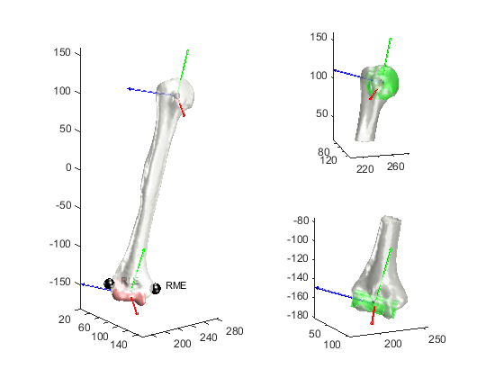

## Using STAPLE algorithms for upper limb applications

### Applying `GIBOC_femur.m` to the humerus
This folder includes a simple example of how the STAPLE algorithms focussed on the lower limb can be adapted for processing also upper limb bones.
A `GIBOC_humerus.m` algorithm is drafted based on `GIBOC_femur.m` and tested by processing a humerus bone geometry (from the LHDL dataset). 
The outputs of `GIBOC_femur.m` have been modified in order to:
1. obtain the correct fields on the JCS and ArtSurf structures
2. perform an appropriate landmarking of the bone
3. plot the bone and morphological items 

### Limitations
Please note that:
1. the `GIBOC_humerus.m` file has still the same console printout of `GIBOC_femur.m`.
2. this example is a proof-of-concept and it has not been tested on an extensive dataset, so we cannot ensure the robustness of `GIBOC_humerus.m`.

